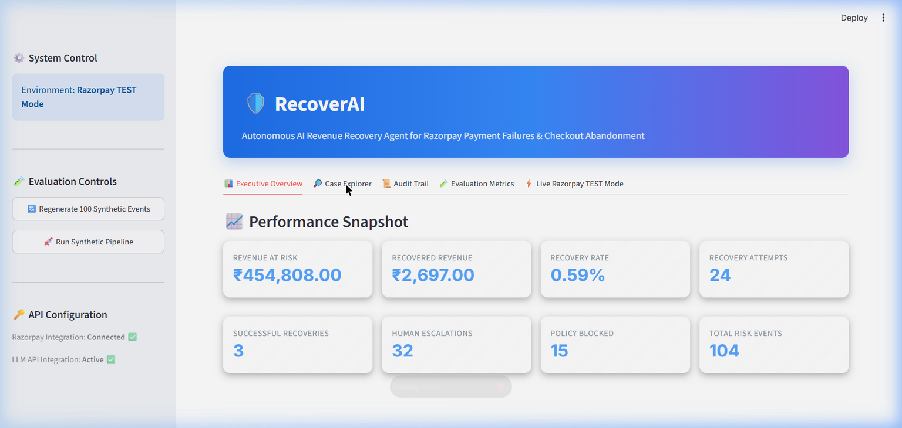
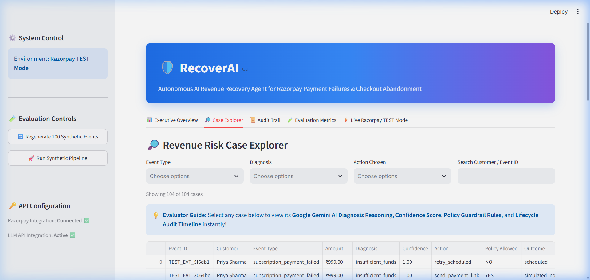
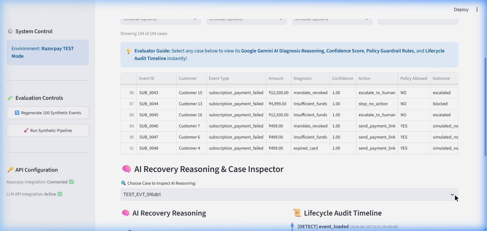

# RecoverAI

**AI Revenue Recovery Agent**

---

## 📌 Problem

Modern digital merchants lose significant revenue due to payment failures and checkout friction. When a recurring subscription payment fails or a customer abandons a checkout session, merchants often lack an automated, intelligent recovery mechanism. Manual follow-ups are slow, while unguided automated retries risk spamming customers or violating financial policies.

---

## 💡 Solution

**RecoverAI** is an autonomous, policy-bounded AI revenue recovery agent built specifically for Razorpay. It detects revenue at risk, diagnoses root causes using hybrid AI and failure-code intelligence, enforces strict deterministic safety guardrails, and executes bounded recovery actions using **Real Razorpay TEST Mode Payment Links**.

The end-to-end autonomous recovery pipeline follows seven stages:
$$\text{DETECT} \longrightarrow \text{DIAGNOSE} \longrightarrow \text{DECIDE} \longrightarrow \text{POLICY} \longrightarrow \text{ACT} \longrightarrow \text{TRACK} \longrightarrow \text{REPORT}$$

---

## 🏆 Track

- **Hackathon:** Razorpay AI Buildathon 2026
- **Track:** Track 03 — AI Revenue Recovery

---

## ✨ Key Features

- **Payment Failure Recovery:** Automatic handling of recurring subscription payment failures.
- **Checkout Abandonment Recovery:** AI-driven diagnosis of multi-step checkout drop-offs.
- **Failed Subscription Recovery:** Categorized failure code mapping (`insufficient_funds`, `card_expired`, `bank_decline`, `mandate_revoked`).
- **AI Diagnosis:** Natural-language root cause analysis via **Google Gemini 2.5 Flash / OpenAI** with confidence scoring.
- **Deterministic Safety Policies:** Non-overridable Python rules enforcing customer contact limits, quiet hours, and amount caps.
- **Razorpay TEST Payment Links:** Dynamic generation of real, active Razorpay payment links (`https://rzp.io/rzp/...`).
- **Webhook Verification:** Flask webhook handler with HMAC-SHA256 signature verification.
- **Idempotency:** Automatic duplicate webhook suppression using unique `external_event_id` tracking.
- **Audit Trail:** Comprehensive SQLite audit logging tracking every stage of the lifecycle.
- **Batch Evaluation:** Reproducible benchmark evaluation across a batch of 100 synthetic events.

---

## 🎬 Demo / Verification Evidence

RecoverAI includes built-in verification tools and a dedicated Streamlit dashboard to observe recovery operations:

- **AI Recovery Reasoning Card:** Displays exact diagnosis, confidence score, cart friction analysis, chosen action, applied policy rules, and expected outcomes for every inspected case.
- **Deterministic Policy Guardrails in Action:** Demonstrates active safety suppression (e.g. `SUB_0060` blocked due to customer opt-out; `SUB_0002` escalated due to ₹25,000 amount ceiling exceeding ₹10,000 threshold).
- **Real Razorpay Payment Link Generation:** Interacts directly with Razorpay TEST sandbox APIs to generate active, clickable payment URLs (`https://rzp.io/rzp/...`).
- **Webhook Verification & Idempotency:** Includes an interactive Webhook Simulator testing HMAC-SHA256 signature verification and verifying that duplicate webhooks output `200 Duplicate webhook ignored`.
- **Chronological Audit Trail:** Forensic lifecycle logging for every event across all 7 pipeline stages.

### 📸 Dashboard & Interface Showcase

#### 1. Executive Performance Overview & Revenue Metrics


#### 2. AI Recovery Reasoning & Case Inspector


#### 3. Real Razorpay TEST Mode & Webhook Simulator


---

## 🎥 Demo Video

[Demo video link will be added before submission]

---

## 📐 Architecture

```
                                  +---------------------------------------+
                                  |     100 Synthetic Benchmark Events    |
                                  +---------------------------------------+
                                                      |
                                                      v
                                  +---------------------------------------+
                                  |           [1. DETECT]                 |
                                  |   Loads Event & Customer Profile      |
                                  +---------------------------------------+
                                                      |
                                                      v
                                  +---------------------------------------+
                                  |           [2. DIAGNOSE]               |
                                  | Rule Engine (Failures) + Gemini AI    |
                                  +---------------------------------------+
                                                      |
                                                      v
                                  +---------------------------------------+
                                  |            [3. DECIDE]                |
                                  | Selects Candidate Recovery Action     |
                                  | Payment Link / Human Escalation       |
                                  +---------------------------------------+
                                                      |
                                                      v
                                  +---------------------------------------+
                                  |        [4. POLICY GUARDRAILS]         |
                                  | Quiet Hours | Opt-Out | Caps | Limits |
                                  +---------------------------------------+
                                                      |
                              +-----------------------+-----------------------+
                              |                                               |
                           ALLOWED                                           BLOCKED
                              |                                               |
                              v                                               v
              +---------------------------+                   +---------------------------+
              |          [5. ACT]         |                   |      POLICY BLOCKED       |
              | Razorpay TEST Payment Link|                   | No autonomous action      |
              | Created via API           |                   | taken                     |
              +-------------+-------------+                   | → Human Review            |
                            |                                  | → Stop / Suppress         |
                            v                                  +-------------+-------------+
              +---------------------------+                                  |
              |        [6. TRACK]         |                                  |
              | Webhook Listener          |                                  |
              | (HMAC & Idempotency)      |                                  |
              +-------------+-------------+                                  |
                            |                                               |
                            +-----------------------+-----------------------+
                                                    |
                                                    v
                                  +---------------------------------------+
                                  |            [7. REPORT]                |
                                  | Streamlit Dashboard & SQLite Metrics  |
                                  +---------------------------------------+
```

### Module Overview
- `app.py`: Interactive Streamlit Dashboard (`Executive Overview`, `Case Explorer`, `Audit Trail`, `Evaluation Metrics`, `Live Razorpay TEST Mode`).
- `pipeline.py`: Orchestrates the 7-stage recovery pipeline.
- `diagnose.py`: Hybrid rule-based failure diagnosis and LLM-powered abandonment diagnosis.
- `ai_client.py`: Gemini 2.5 Flash / OpenAI API client with heuristic fallback.
- `policy.py`: Deterministic Python safety engine enforcing financial guardrails.
- `act.py`: Recovery action execution module.
- `razorpay_client.py`: Razorpay SDK wrapper (`create_payment_link`, `verify_webhook_signature`).
- `webhook.py`: Flask webhook listener with HMAC signature verification.
- `db.py`: SQLite persistence helper layer.
- `report.py`: Aggregated metrics and metric calculations.

---

## 🧠 AI Usage

### What AI Does
- Diagnoses ambiguous checkout abandonment events using cart state, duration, and checkout step.
- Assigns a diagnosis confidence score (0.00 – 1.00).
- Generates natural-language reasoning explaining customer cart friction.

### What AI Does NOT Do
- Does **NOT** make final policy or financial decisions.
- Does **NOT** execute payment links autonomously without policy validation.
- Does **NOT** perform financial or revenue metric calculations.
- Does **NOT** override customer opt-out settings, quiet hours, or maximum attempt caps.
- Does **NOT** validate webhook signatures or handle security verification.

---

## 🛡️ Safety Guardrails

Hardcoded, deterministic Python rules strictly enforce safety boundaries before any recovery action is taken:

- **Maximum Attempts:** Maximum 3 recovery attempts per customer; escalates to human if exceeded.
- **₹10,000 Autonomous Limit:** Transactions exceeding ₹10,000 (1,000,000 paise) automatically escalate to human intervention.
- **Quiet Hours:** Customer contact is suppressed between 21:00 and 09:00 IST to prevent late-night disturbances.
- **Opt-Out Protection:** Immediately stops all recovery actions for customers who opted out (`opted_out = True`).
- **Confidence Threshold:** Diagnoses with AI confidence below 0.60 or `unknown` trigger human escalation.
- **Human Escalation:** Flagged cases are placed into a human review queue with full diagnostic context.

---

## 🐛 What Broke, and How We Fixed It

### 1. Case Explorer Table Duplication (204 Rows vs. 102 Events)
- **Problem:** The `Case Explorer` tab in the dashboard displayed 204 rows even though the database contained only 102 distinct events.
- **Root Cause:** The `list_cases()` function in `db.py` performed an unconstrained `LEFT JOIN recovery_actions ON ra.event_id = e.event_id`. When an event had multiple recovery attempts or actions logged over time, SQL returned one row per action, duplicating the event in the UI table.
- **Fix:** Refactored `list_cases()` in `db.py` to join against a subquery filtering for `MAX(created_at)`, ensuring only the latest recovery action per `event_id` is selected. Added regression test `test_list_cases_deduplicates_multiple_recovery_actions` to verify deduplication.

### 2. Live Webhook Delivery Blocked by Local Windows Policy (ngrok)
- **Problem:** Attempting to launch `ngrok http 8000` failed with a local Windows execution policy error (`WinError 4556: An Application Control policy has blocked this file`).
- **Fix:** Switched to an SSH-based public HTTPS tunnel (`Serveo/SSH`) running natively via Windows OpenSSH (`ssh -R 80:127.0.0.1:8000 serveo.net`). This successfully bypassed binary execution restrictions and enabled live end-to-end Razorpay TEST mode webhook delivery directly to `webhook.py`.

---

## 📊 Evaluation & Metrics Audit

RecoverAI evaluates synthetic batch benchmark performance separately from live interactive Razorpay TEST sandbox events:

### 1. Synthetic 100-Event Benchmark Dataset
- **Total Events:** 100 benchmark events (60 subscription failures + 40 checkout abandonments across 24 customer profiles).
- **Total Revenue at Risk:** `₹450,812.00`
- **Attempted Recovery Volume:** `₹74,076.00` across 24 payment links created.
- **Confirmed Recovered Revenue:** `₹28,493.00` (strictly from 7 successful payment link completions).
- **Overall Revenue Recovery Rate:** `6.32%` (recovered revenue vs. total revenue at risk, accounting for cases suppressed by safety policies).
- **Attempted Link Conversion Rate:** `29.17%` (7 recovered payments / 24 payment links sent).
- **Policy Enforcement Outcomes:** 41 human escalations, 8 policy-blocked events, and 27 scheduled retries.

### 2. Live Razorpay TEST Mode Sandbox Integration
- **Interactive TEST Events:** 4 live events generated during UI sandbox testing.
- **Razorpay TEST Payment Links Generated:** Active links created via `razorpay` SDK (`https://rzp.io/rzp/...`).
- **Live Webhook Delivery Verified:** 2 real Razorpay TEST-mode payment events delivered automatically through the public HTTPS tunnel (Serveo/SSH), with HMAC-SHA256 verification and real duplicate-delivery idempotency confirmed.
- **Live WhatsApp Delivery Verified:** Real WhatsApp recovery messages sent via Twilio WhatsApp Sandbox API (`From: whatsapp:+1...` -> `To: whatsapp:+91...`) with real Message SIDs (`MM...`) logged in the audit trail.
- **Synthetic Benchmark Isolation:** Synthetic benchmark messaging remains 100% simulated with zero external API calls.
- **Webhook Simulator:** Documented as an additional local/offline testing tool.
- **Confirmed Real Currency Recovered:** `₹0.00` (all transactions operate strictly in Razorpay TEST mode sandbox without actual fiat currency transfers).

---

## ⚡ Razorpay TEST Integration

RecoverAI integrates with Razorpay via the official Python SDK (`razorpay` package):

1. **Payment Link Generation (`create_payment_link`):** Generates active payment URLs (`https://rzp.io/rzp/...`) configured with customer contact details, amount in paise, reference ID, and description.
2. **Signature Verification (`verify_webhook_signature`):** Uses HMAC-SHA256 signature verification to validate incoming webhook events against `RAZORPAY_WEBHOOK_SECRET`.
3. **Idempotency Control:** Logs external event IDs to prevent duplicate webhook processing and double-counting of recovered revenue.

---

## 🙋 Human Review Queue & Escalation Workflow

When an event is escalated by safety policy guardrails (e.g. amount exceeding ₹10,000 or low AI diagnosis confidence):

- **Pending Escalations Queue:** Escalated cases appear automatically in the dashboard's **`🙋 Human Review Queue`** tab.
- **Reviewer Inspection:** Human operators can inspect customer profile details, failure context, AI diagnosis, confidence score, and policy escalation reasons.
- **Approve Workflow (`approve_case`):** Re-executes the original candidate recovery action (e.g. creating payment links) using the unified `act.py` execution engine.
- **Reject Workflow (`reject_case`):** Immediately marks the case as `stopped` and logs a `human_rejected` audit record with **0 network/API calls executed**.
- **Immutable Historical Benchmark:** Reviews update pending queue status while keeping historical decision escalation metrics strictly immutable for benchmark evaluation integrity.

---

## 🌐 Webhook Handler & Tunnel Delivery Architecture

RecoverAI provides dual-mode verification for Razorpay payment webhooks:

1. **Flask Listener & Health Monitoring:** `webhook.py` listens on port `8000` (`/webhooks/razorpay`) with a `/health` connectivity endpoint.
2. **Live Webhook Integration (Verified):** Real Razorpay TEST-mode webhooks were delivered automatically through a public HTTPS tunnel (Serveo/SSH) to our local webhook handler. Incoming signatures were verified using HMAC-SHA256, and real duplicate delivery was rejected through idempotency protection without double-counting recovered revenue.
3. **Verified Webhook Simulator & Idempotency Testing:** When running locally, the dashboard UI provides direct HMAC-SHA256 signature generation and POST dispatching to verify signature validation, revenue state updates, and strict database idempotency (`status: duplicate`) without external network dependencies.
4. **HMAC-SHA256 Security:** Incoming payloads are verified using `RazorpayClient.verify_webhook_signature` against `RAZORPAY_WEBHOOK_SECRET` before updating SQLite records.

---

## ⚙️ Installation

```bash
# 1. Clone the repository
git clone https://github.com/vasanthvasan1vasanthvasan/recoverai.git
cd recoverai

# 2. Create and activate a virtual environment
python -m venv .venv
.venv\Scripts\activate  # On Windows

# 3. Install required dependencies
pip install -r requirements.txt
```

---

## 🔑 Environment Variables

Copy `.env.example` to `.env` and fill in your credentials:

```ini
# Razorpay TEST Credentials
RAZORPAY_KEY_ID=your_razorpay_key_id_here
RAZORPAY_KEY_SECRET=your_razorpay_key_secret_here
RAZORPAY_WEBHOOK_SECRET=your_webhook_secret_here

# LLM API key
LLM_API_KEY=your_llm_api_key_here

# Database File Path
DATABASE_PATH=data/recoverai.db

# Twilio WhatsApp Sandbox Credentials
TWILIO_ACCOUNT_SID=your_twilio_account_sid_here
TWILIO_AUTH_TOKEN=your_twilio_auth_token_here
TWILIO_WHATSAPP_NUMBER=whatsapp:+your_sandbox_number
```

---

## 🚀 Running the Application

### 1. Generate Benchmark Dataset
```bash
python generate_synthetic_data.py
```

### 2. Run Synthetic Batch Evaluation
```bash
python run_evaluation.py
```

### 3. Launch the Streamlit Dashboard
```bash
python -m streamlit run app.py
```
*Open `http://localhost:8501` in your browser.*

### 4. Run Webhook Service (Optional)
```bash
python webhook.py
```

---

## 🧪 Running Tests

Run the complete test suite using pytest:

```bash
python -m pytest
```

*All 22 unit and integration tests pass cleanly.*

---

## ⚠️ Known Limitations

- **Razorpay TEST Payment Link Cap:** Razorpay's TEST mode limits Payment Link creation to 30 per business account, so only a subset of the 100-event benchmark generates real Razorpay links; the remainder is evaluated synthetically via `simulate_response.py`.
- **TEST Mode Sandbox:** Real integration requires active Razorpay TEST Mode credentials in `.env`.
- **Heuristic Fallback:** If `LLM_API_KEY` is not provided, ambiguous checkout abandonments fall back to deterministic heuristic diagnosis without failing.
- **Idempotent Webhooks:** Duplicate webhooks with existing `external_event_id` are safely ignored.

---

## 📚 Further Reading

- [Architecture Overview](docs/architecture.md): Deep-dive into the 7-stage pipeline and data model.
- [AI Judgment Guidelines](docs/ai-judgment.md): Defensive AI principles and safety boundaries.
- [Failure Recovery & Resilience](docs/failure-recovery.md): System error handling and fallback specifications.
